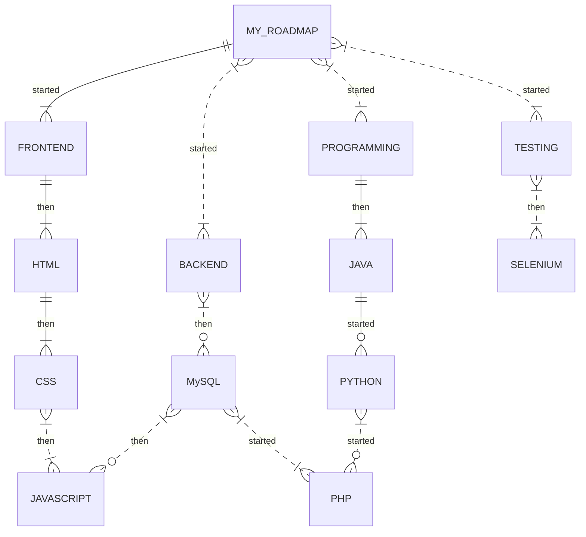

 

<a href="#">

</a>

    

 

 
  

```mermaid
erDiagram
    MY_ROADMAP ||--|{ FRONTEND : started
    FRONTEND ||--|{ HTML : then
    HTML ||--|{ CSS : then
    CSS }|..|{ JAVASCRIPT : then
    MY_ROADMAP }|..|{ PROGRAMMING : started
    PROGRAMMING ||--|{ JAVA : then
    JAVA ||--o{ PYTHON : started
    MY_ROADMAP }|..|{ BACKEND : started
    MY_ROADMAP }|..|{ TESTING : started
    TESTING }|..|{ SELENIUM : then
    BACKEND }|..o{ MySQL : then
    MySQL }|..o{ JAVASCRIPT : then
    MySQL }|..|{ PHP : started
    PYTHON }|..o{ PHP : started
```
  
